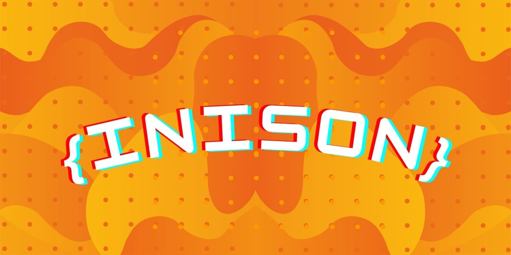

[](https://github.com/inicontent/inison)

# Inison :pencil:

[](https://www.npmjs.org/package/inibase) [](./LICENSE) [](https://github.com/inicontent/inison/pulse) [](https://github.com/inicontent/inison)

> An alternative to JSON, aiming to reduce disk usage by storing decoded data and eliminating double-quotes :fire:

## Features

- **Lightweight** 🪶
- **Minimalist** :white_circle: (but powerful)
- **TypeScript** :large_blue_diamond:
- **Super-Fast** :zap:
- **Suitable for large data** :page_with_curl:
- **Support Compression** :eight_spoked_asterisk:
- **Safe** :lock:
- **Easy to use** :bread:
- **...** and much more :rocket:

## Usage

```js
import Inison from "inison";
const myObj = {
  name: "Jo,hn",
  age: 21,
  city: "New York",
  hobbies: ["Reading", "Tra[veling", ["test", "test2", { test: true }]],
};

// Stringify the object
const stringifiedObj = Inison.stringify(myObj);
// {name:Jo\,hn,age:21,city:New York,hobbies:[Reading,Tra\veking,[test,test2,{test:true}]]}

// Unstringify the stringified object
const unstringifiedObj = Inison.unstringify(stringifiedObj);
```

If you like Inison, please sponsor: [GitHub Sponsors](https://github.com/sponsors/inicontent) || [Paypal](https://paypal.me/KarimAmahtil).

## Install

```js
<npm|pnpm|yarn> install inison
```

## License

[MIT](./LICENSE)
